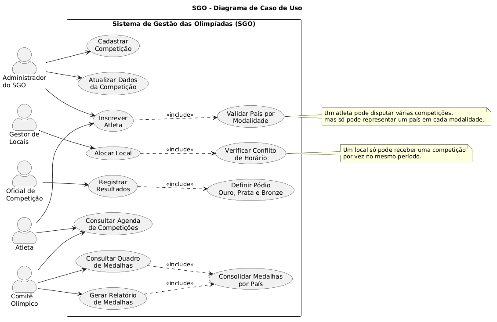
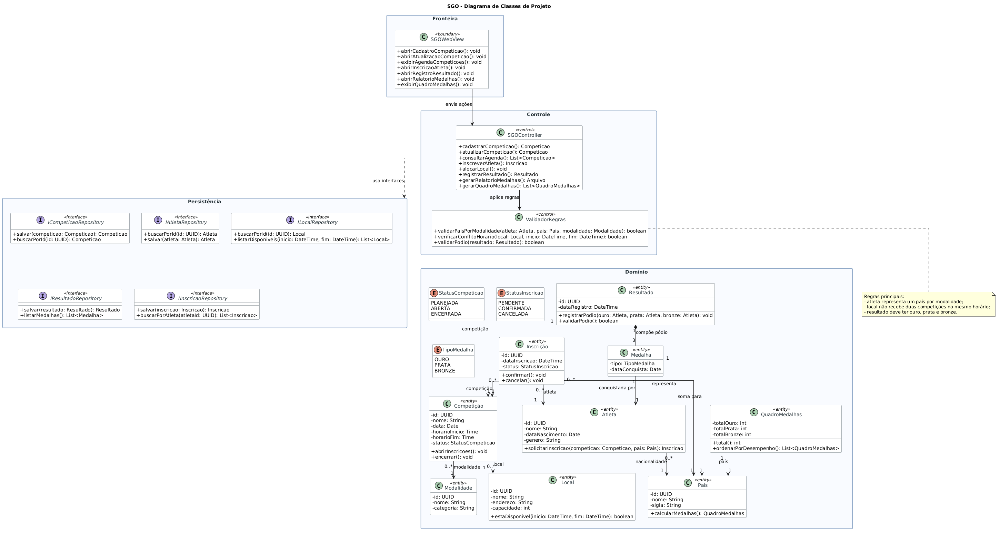
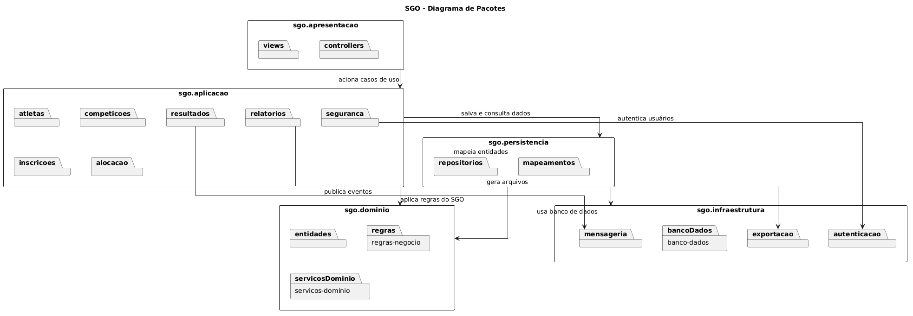
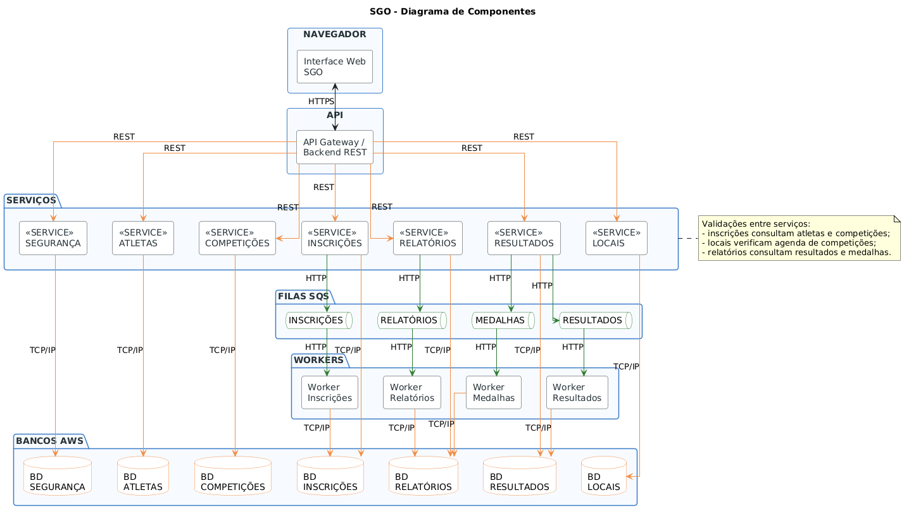
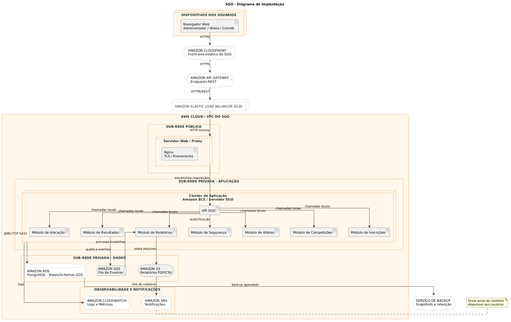

<h1 align="center">Sistema de Gestão das Olimpíadas</h1>

<p align="center">
  <strong>SGO - Modelagem UML para gestão de competições, atletas, locais, resultados e medalhas olímpicas.</strong>
</p>

<p align="center">
  
  
  
  
</p>

<p align="center">
  <a href="#visão-geral">Visão Geral</a> •
  <a href="#escopo-do-sistema">Escopo</a> •
  <a href="#diagramas-uml">Diagramas</a> •
  <a href="#checklist-de-entrega">Checklist</a>
</p>

---

## Identificação

| Integrantes |
| --- |
| Nome do aluno 1 |
| Nome do aluno 2 |

## Visão Geral

O **Sistema de Gestão das Olimpíadas (SGO)** foi modelado para apoiar a organização de competições olímpicas. A proposta contempla o cadastro de competições, inscrição de atletas, alocação de locais, registro de resultados e geração de relatórios de medalhas por país.

Este repositório contém a documentação UML solicitada para o trabalho da disciplina **Projeto de Software**, incluindo os arquivos-fonte em **PlantUML** e as imagens exportadas em PNG.

## Resumo Executivo

| Item | Descrição |
| --- | --- |
| Tema | Sistema para gerenciamento de competições olímpicas. |
| Foco | Organização de competições, atletas, locais, resultados e medalhas. |
| Atores principais | Administrador, atleta, gestor de locais, oficial de competição, usuário do sistema e comitê olímpico. |
| Entidades centrais | País, atleta, modalidade, local, competição, inscrição, resultado, medalha e quadro de medalhas. |
| Arquitetura | Aplicação web com API, serviços, persistência, filas, workers e infraestrutura em nuvem. |
| Diferenciais | Inclui validações de negócio, segurança, observabilidade, mensageria, exportação de relatórios e backup. |

## Objetivo

Representar, por meio de diagramas UML, a estrutura funcional, lógica, arquitetural e física do SGO, garantindo que as regras de negócio descritas no enunciado sejam contempladas de forma clara, organizada e coerente entre os diagramas.

## Escopo Do Sistema

| Área | Responsabilidades |
| --- | --- |
| Competições | Cadastrar, atualizar e consultar competições, contendo modalidade, data, horário, local e atletas inscritos. |
| Atletas | Registrar a participação de atletas em competições e validar a representação por país em cada modalidade. |
| Locais | Alocar espaços para competições, evitando conflitos de horário. |
| Resultados | Registrar primeiro, segundo e terceiro colocados após a realização da competição. |
| Medalhas | Consolidar ouro, prata e bronze por país. |
| Relatórios | Gerar e exportar relatórios de desempenho por país. |
| Segurança | Controlar autenticação, perfis de acesso e proteção das operações administrativas. |

## Entregáveis

| Diagrama | Finalidade | Fonte PlantUML | Imagem |
| --- | --- | --- | --- |
| Caso de Uso | Mostra atores e funcionalidades principais. | [`codigos/diagrama-de-caso-de-uso.puml`](codigos/diagrama-de-caso-de-uso.puml) | [`imagens/diagrama-de-caso-de-uso.png`](imagens/diagrama-de-caso-de-uso.png) |
| Classes | Representa classes de projeto, entidades, controles, fronteira e persistência. | [`codigos/diagrama-de-classes.puml`](codigos/diagrama-de-classes.puml) | [`imagens/diagrama-de-classes.png`](imagens/diagrama-de-classes.png) |
| Pacotes | Organiza responsabilidades lógicas do sistema. | [`codigos/diagrama-de-pacotes.puml`](codigos/diagrama-de-pacotes.puml) | [`imagens/diagrama-de-pacotes.png`](imagens/diagrama-de-pacotes.png) |
| Componentes | Descreve a arquitetura em serviços, API, bancos, filas e workers. | [`codigos/diagrama-de-componentes.puml`](codigos/diagrama-de-componentes.puml) | [`imagens/diagrama-de-componentes.png`](imagens/diagrama-de-componentes.png) |
| Implantação | Mostra a distribuição física em infraestrutura de nuvem. | [`codigos/diagrama-de-implantação.puml`](codigos/diagrama-de-implantação.puml) | [`imagens/diagrama-de-implantação.png`](imagens/diagrama-de-implantação.png) |

## Regras De Negócio

| Código | Regra | Descrição |
| --- | --- | --- |
| RN01 | Cadastro de competições | O sistema deve permitir cadastrar competições com modalidade, data, horário, local e lista de atletas inscritos. |
| RN02 | Inscrição de atletas | Atletas de diferentes países podem se inscrever em competições específicas. Cada atleta pode participar de várias competições. |
| RN03 | Representação por país | Um atleta só pode representar um país em cada modalidade. |
| RN04 | Alocação de locais | Um local só pode receber uma competição por vez, evitando conflitos de horário. |
| RN05 | Controle de resultados | Após a realização da competição, devem ser registrados ouro, prata e bronze. |
| RN06 | Relatório de medalhas | O sistema deve gerar relatórios de medalhas por país, consolidando ouro, prata e bronze. |

## Histórias De Usuário

| ID | História |
| --- | --- |
| US01 | Como administrador do SGO, quero cadastrar competições com modalidade, data, horário, local e atletas inscritos, para organizar a agenda oficial das Olimpíadas. |
| US02 | Como administrador do SGO, quero atualizar os dados de uma competição, para corrigir informações de agenda, local ou modalidade quando necessário. |
| US03 | Como atleta, quero me inscrever em uma ou mais competições, para participar das modalidades nas quais estou apto. |
| US04 | Como sistema, quero validar que um atleta represente apenas um país por modalidade, para cumprir as regras de participação. |
| US05 | Como gestor de locais, quero alocar uma competição em um local disponível, para evitar conflitos de horário e uso do espaço. |
| US06 | Como usuário do sistema, quero consultar a agenda de competições, para acompanhar datas, horários, locais e modalidades. |
| US07 | Como oficial de competição, quero registrar o resultado final de uma competição, para definir os atletas classificados em primeiro, segundo e terceiro lugares. |
| US08 | Como comitê olímpico, quero gerar relatórios de medalhas por país, para acompanhar o desempenho das delegações. |
| US09 | Como usuário do sistema, quero consultar o quadro de medalhas, para visualizar a classificação geral por ouro, prata e bronze. |
| US10 | Como comitê olímpico, quero exportar relatórios em arquivo, para divulgar e arquivar os resultados oficiais. |

## Arquitetura Resumida

O SGO foi modelado com uma arquitetura em camadas e serviços:

| Camada | Descrição |
| --- | --- |
| Apresentação | Interface web usada pelos atores do sistema. |
| API | Ponto central de entrada das requisições. |
| Serviços | Módulos independentes para atletas, competições, inscrições, locais, resultados, relatórios e segurança. |
| Persistência | Repositórios e bancos responsáveis por armazenamento dos dados. |
| Mensageria | Filas SQS e workers para processamento assíncrono de inscrições, resultados, medalhas e relatórios. |
| Infraestrutura | CloudFront, API Gateway, Load Balancer, VPC, RDS, S3, CloudWatch, SNS e backup. |

## Diagramas UML

Cada diagrama possui duas versões: o arquivo-fonte em PlantUML na pasta [`codigos`](codigos) e a imagem PNG renderizada na pasta [`imagens`](imagens).

### Diagrama De Caso De Uso

Representa os atores do SGO e suas interações com os principais casos de uso, como cadastrar competição, inscrever atleta, alocar local, registrar resultados e consultar medalhas.

<p align="center">
  
</p>

Arquivo PlantUML: [`codigos/diagrama-de-caso-de-uso.puml`](codigos/diagrama-de-caso-de-uso.puml)

### Diagrama De Classes

Modela o SGO como um **Diagrama de Classes de Projeto**, separando classes de fronteira, controle, domínio e persistência. Inclui entidades, interfaces, atributos, operações, multiplicidades e navegabilidade.

<p align="center">
  
</p>

Arquivo PlantUML: [`codigos/diagrama-de-classes.puml`](codigos/diagrama-de-classes.puml)

### Diagrama De Pacotes

Organiza o sistema em pacotes responsáveis por apresentação, aplicação, domínio, persistência e infraestrutura.

<p align="center">
  
</p>

Arquivo PlantUML: [`codigos/diagrama-de-pacotes.puml`](codigos/diagrama-de-pacotes.puml)

### Diagrama De Componentes

Demonstra a arquitetura de componentes do SGO com navegador, API central, serviços independentes, bancos AWS por serviço, filas SQS e workers para processamento assíncrono.

<p align="center">
  
</p>

Arquivo PlantUML: [`codigos/diagrama-de-componentes.puml`](codigos/diagrama-de-componentes.puml)

### Diagrama De Implantação

Apresenta a distribuição física da solução em infraestrutura de nuvem, incluindo dispositivos dos usuários, CloudFront, API Gateway, Load Balancer, VPC, sub-redes, cluster de aplicação, banco de dados, filas, armazenamento, observabilidade, notificações e backup.

<p align="center">
  
</p>

Arquivo PlantUML: [`codigos/diagrama-de-implantação.puml`](codigos/diagrama-de-implantação.puml)

## Estrutura Do Repositório

```text
.
+-- README.md
+-- codigos
|   +-- diagrama-de-caso-de-uso.puml
|   +-- diagrama-de-classes.puml
|   +-- diagrama-de-componentes.puml
|   +-- diagrama-de-implantação.puml
|   +-- diagrama-de-pacotes.puml
+-- imagens
    +-- diagrama-de-caso-de-uso.png
    +-- diagrama-de-classes.png
    +-- diagrama-de-componentes.png
    +-- diagrama-de-implantação.png
    +-- diagrama-de-pacotes.png
```

## Como Visualizar Ou Editar

Os arquivos `.puml` podem ser abertos em qualquer editor com suporte a PlantUML, como Visual Studio Code com extensão PlantUML, IntelliJ IDEA ou o editor online do PlantUML.

Para renderizar novamente, use os arquivos da pasta [`codigos`](codigos) e exporte as imagens atualizadas para a pasta [`imagens`](imagens).

Exemplo de renderização local:

```bash
plantuml -tpng codigos/*.puml -o ../imagens
```

## Critérios De Qualidade

| Critério | Como foi atendido |
| --- | --- |
| Clareza | Diagramas separados por finalidade, com nomes objetivos e leitura organizada. |
| Completude | Todos os diagramas solicitados foram entregues em PlantUML e PNG. |
| Coerência | As mesmas regras, entidades e responsabilidades aparecem de forma consistente nos diagramas. |
| Organização | Pastas separadas para códigos-fonte dos diagramas e imagens renderizadas. |
| Arquitetura | O modelo inclui camadas, serviços, banco, filas, workers, segurança e infraestrutura de implantação. |

## Checklist De Entrega

| Item | Status |
| --- | --- |
| README com documentação do sistema | Completo |
| Histórias de usuário | Completo |
| Diagrama de Caso de Uso | Completo |
| Diagrama de Classes | Completo |
| Diagrama de Pacotes | Completo |
| Diagrama de Componentes | Completo |
| Diagrama de Implantação | Completo |
| Arquivos PlantUML | Completo |
| Imagens PNG dos diagramas | Completo |

## Ferramenta Utilizada

Os diagramas foram modelados com **PlantUML**, conforme solicitado no enunciado do trabalho.

Links úteis:

- [PlantUML](https://plantuml.com/)
- [Guia PlantUML](https://plantuml.com/guide)

---

<p align="center">
  <strong>Trabalho de Projeto de Software</strong><br>
  Sistema de Gestão das Olimpíadas
</p>
